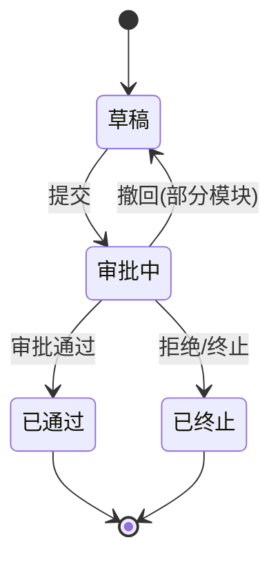
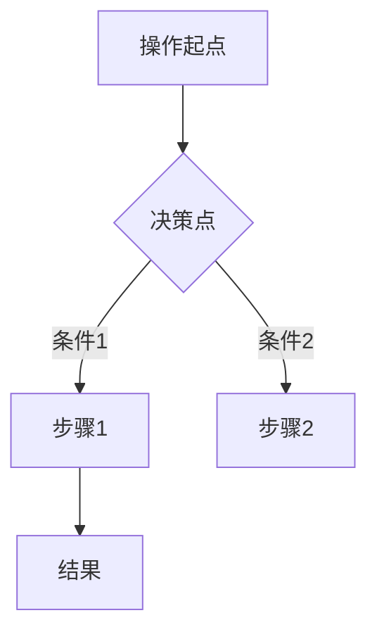

# 概要设计说明书 — 模板参考

本文件定义概要设计说明书的完整章节骨架、写作规范和示例。SKILL.md 在 Phase 4 文档生成时引用此文件。

---

## 文档头部模板

```markdown
# {项目全称} 概要设计说明书

{编制公司名称}

{文档日期，格式：YYYY年M月}

**变更记录**

| 更改时间 | 更改人 | 更改的主要内容 | 批准人 | 版本号 |
|----------|--------|---------------|--------|--------|
| {日期} | — | 创建 | — | {版本号} |
```

---

## 章节骨架

```
1. 引言
   1.1 编写目的
   1.2 读者对象
   1.3 术语表
   1.4 参考资料
2. 技术选型
   2.1 系统硬件环境
   2.2 系统的体系结构
3. 功能模块设计                    ← 核心章节，目标占比 60%+
   3.0 系统功能总览
       - 模块全景图（ASCII art）
       - 通用规则
       - 数据权限层级表格
       - 审批状态机（Mermaid stateDiagram-v2）
   3.x 各业务模块（按 PRD 中的模块顺序）
       - 模块简述（2-3句）
       - 功能设计表格
       - 业务流程图（涉及审批的模块必须有，Mermaid flowchart TD）
   汇总表
       - 功能权限矩阵
       - 编号规则汇总
       - 审批需求汇总（需审批 + 无需审批两张表）
4. 非业务功能需求
   4.1 安全性需求
   4.2 稳定性需求
   4.3 性能需求
5. 系统集成方案
   5.1 系统架构设计
   5.2 网络拓扑设计
   5.3 系统部署设计
   5.4 技术路线设计
   5.5 系统界面设计
6. 接口设计
   6.1 接口规范
   6.2 模块接口概述
7. 安全性设计
   7.1 信息系统面临的风险
   7.2 系统安全平台
   7.3 安全层次
   7.4 系统安全策略
   7.5 应用系统的安全设计
   7.6 数据库备份策略
```

---

## 各章节写作指南

### 第1章 引言

固定文本，仅替换项目名称和日期。

**1.1 编写目的**（固定）：
> 本文档定义了{项目全称}的概要设计，其目的在于：
> 1. 阐明系统总体设计考虑，包括：用户组织机构、系统输入/输出、基本业务流程、外部接口、数据结构设计和系统出错处理等，为系统的详细设计提供基础。
> 2. 确定系统的技术架构和技术路线，规避可能存在的技术风险，有助于项目成员尽快熟悉相关开发、分析和设计工具。
> 3. 确定系统的业务模型、业务流程、逻辑结构、物理结构、网络拓扑、部署结构等关键设计要素，为后续的集成测试提供依据。
> 4. 明确系统接口，同时确定初步的接口技术实现。

**1.2 读者对象**（固定）：
> 软件开发项目管理者、系统设计人员、开发人员、测试人员及技术支持实施人员。

**1.3 术语表**：从技术架构文档中提取术语。

**1.4 参考资料**：列出所有输入文档的名称、版本和说明。

### 第2章 技术选型

- 2.1 硬件环境：直接使用技术架构文档中的服务器配置表格
- 2.2 体系结构：概述级别描述（架构模式、部署方式、目标并发），附架构分层图（ASCII art）

### 第3章 功能模块设计（核心）

**3.0 系统功能总览**

模块全景图示例（根据实际模块名替换）：
```
┌──────────────────────────────────────────────────────────┐
│                       系统名称                            │
├──────────┬──────────┬──────────┬──────────┬──────────────┤
│ 模块组A   │ 模块组B   │ 模块组C   │ 模块组D   │ 模块组E      │
├──────────┼──────────┼──────────┼──────────┼──────────────┤
│ 子模块1   │ 子模块1   │ 子模块1   │ 子模块1   │ 子模块1      │
│ 子模块2   │ 子模块2   │ 子模块2   │ 子模块2   │ 子模块2      │
│ ──详情──  │ ──详情──  │ ...      │ ...      │              │
│ 子模块3   │ 子模块3   │ 子模块M   │ 子模块K   │              │
│ ...      │★特有模块  │           │          │              │
│ 子模块N   │ 子模块N-1 │           │          │              │
├──────────┴──────────┴──────────┴──────────┴──────────────┤
│       平台基础能力（按实际内容填写）                        │
└──────────────────────────────────────────────────────────┘

★ = 某模块组特有的模块
模块组A与模块组B的差异：B 无子模块X/Y/Z；B 特有★模块
```

**全景图生成规则（必须遵守）**：
1. **名称完整**：每个子模块名必须与 PRD 原文标题一致，禁止缩写（PRD"基金分配"不可简写为"分配"，PRD"尽职调查"不可简写为"尽调"）
2. **每列完整**：多个模块组共享子模块时，每个组的列都必须完整列出该组拥有的所有子模块，禁止用"复用XX其余模块"等模糊表述
3. **标注差异**：用 ★ 标注某模块组特有的子模块，图下方说明标记含义和组间差异
4. **层级提示**：PRD 有父级分组（如"基金详情"下辖多个子模块）时，用分隔线 `──详情──` 在全景图中标识层级边界

审批状态机示例：


**3.x 各业务模块**

每个模块包含三部分：

1. **模块简述**（2-3句话）：模块用途 + 核心业务场景 + 涉及的角色

2. **功能设计表格**：

| 序号 | 业务模块 | 功能名称 | 功能要求 | 功能设计 |
|------|---------|---------|---------|---------|
| 1 | XX管理 | YY功能 | 一句话描述需求 | 操作级步骤描述 |

3. **业务流程图**（涉及审批的模块必须有）：



**汇总表**

三张汇总表放在所有模块之后：
- 功能权限矩阵：角色 × 模块，标注各角色的操作权限
- 编号规则汇总：模块 / 业务对象 / 编号前缀 / 编号规则 / 示例
- 审批需求汇总：分"需要审批"和"无需审批"两张表

### 第4章 非业务功能需求

从技术架构文档提取，概述级别。每小节 3-5 句话，覆盖：
- 安全性：数据加密、权限控制、并发处理
- 稳定性：事务管理、自动重启、备份恢复
- 性能：目标并发、响应时间、缓存策略

### 第5章 系统集成方案

**去重规则**：第5章与第2章都涉及架构和部署，必须避免大段重复。第2章写架构概述和模块划分，第5章侧重补充性内容。重复的部分用"详见第 2.x 节"引用，不复制粘贴。

- 5.1 架构设计：简要引用第2章（"系统架构详见第 2.2 节"），仅补充第2章未覆盖的集成细节
- 5.2 网络拓扑：三区隔离描述（ASCII art）— 第5章独有内容
- 5.3 部署设计：环境规划引用第2章，补充部署组件列表（含部署数量）+ 日志方案表格
- 5.4 技术路线：前后端技术栈详细版本表格（技术/版本/用途）— 第5章独有内容
- 5.5 界面设计：整体 UI 风格描述（2-3句）— 第5章独有内容

### 第6章 接口设计

- 6.1 接口规范：规范表格 + 认证方式 + 统一响应格式 + 错误码
- 6.2 模块接口概述：按模块列出接口分类表格（接口分类/说明）

**降级策略**（无接口设计文档时）：仅写 6.1 的概述（基础URL、协议、格式），6.2 按模块名列出接口分类名，不展开。

### 第7章 安全性设计

按以下结构展开（允许使用通用模板文字充实篇幅，这是交付文档的行业惯例）：

- 7.1 风险：被动攻击/主动攻击分类 + 本系统面临的典型风险
- 7.2 安全平台：安全体系概述
- 7.3 安全层次：主机/物理/链路/网络/操作系统/数据库/应用 逐层描述
- 7.4 安全策略：管理人员/操作管理/培训/制度化/应急措施
- 7.5 应用安全：数据安全（加密方式）+ RBAC 授权 + 输入安全 + 审计日志
- 7.6 备份策略：全量备份 + 保留周期 + 恢复验证 + 异地备份

---

## 功能设计列写作公式

```
操作入口
→ 填写字段（列举关键字段，标注"自动带出"/"必填"/"可选"/"条件必填"）
→ 保存行为（保存为草稿，可编辑和删除）
→ 提交行为（进入审批流程，不可编辑）
→ 审批/流程触发点（明确说明触发什么审批、有无特殊节点）
→ 后续可执行操作（撤回/终止/结束等）
→ 数据权限/可见性
→ 导出/打印支持
```

**示例**：
> 用户点击新增按钮，系统自动生成申请编号（CGSQ+年份+4位流水号），自动带出申请人（默认当前登录人）、申请日期。用户填写项目名称（必填）、采购需求部门（必填，从组织架构选择）、预计金额（必填，正数保留两位小数）。采购方式由系统根据金额和类型自动判断显示。点击保存后为草稿状态，可编辑和删除。点击提交后进入审批流程，不可编辑。审批终止释放占用预算，审批成功后实际扣减预算。支持打印和导出。
